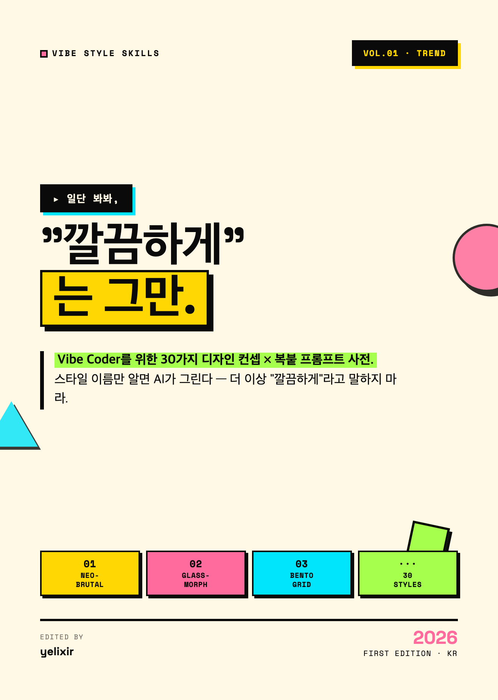

<div align="center">

# vibe-style-skills

**이름만 알면 AI가 그린다.**<br>
30 named design styles — as Claude/GPT skills & copy-paste prompts for vibe coders.

[](./LICENSE)
[](#-the-30-styles)
[](./ebook/FREE-PREVIEW.pdf)
[](#-english)

</div>

---



## 🎯 The problem

When you tell an AI:

> "Make me a clean, modern landing page"

…you get the same default mediocre output everyone gets. But when you say:

> "Make me a **Neo-Brutalism** landing page — cream `#FFF9E6` background, 2px solid black borders, 4px offset shadows, Space Grotesk headlines"

…the AI locks onto a *specific visual grammar* and the output jumps in quality.

**Knowing the name of a style is the highest-leverage design skill of the vibe-coding era.** This repo hands you 30 of those names — as ready-to-use skills and prompts.

## 📦 What's inside

For each of the 30 styles, you get:

| Layer | File | Use |
|---|---|---|
| 🧠 **Skill** | `skills/<name>/SKILL.md` | Drop into Claude/GPT — assistant learns the style's grammar |
| 📋 **Prompts** | `prompts/<name>.md` | Copy-paste into v0, Cursor, Lovable, Bolt, Midjourney, DALL·E |
| 🎨 **Tokens** | `tokens/<name>.{json,css,js}` | Design tokens — import for instant theming |

## 🚀 Quick start

### As a Claude/GPT Skill
```bash
# Copy a skill into your assistant's skills folder
cp skills/neo-brutalism/SKILL.md ~/.zcode/skills/neo-brutalism/SKILL.md
# (or ~/.claude/skills/ for Claude desktop)
```
Then just ask:
> "Build me a portfolio site in **neo-brutalism** style."

### As a prompt
Open `prompts/neo-brutalism.md`, copy the UI-coding or image-generation prompt, paste into your tool. Done.

### As tokens
```js
// tailwind.config.js
const neoBrutalism = require('./tokens/neo-brutalism.js');
module.exports = { theme: { extend: { ...neoBrutalism.tailwind } } };
```

---

## 📚 The 30 styles

### Vol. 1 — **TREND** (what's hot in 2026)

| # | Style | Skill | Prompt | Tokens | Status |
|---|---|---|---|---|---|
| 01 | **Neo-Brutalism** | [SKILL](./skills/neo-brutalism/SKILL.md) | [prompt](./prompts/neo-brutalism.md) | [json](./tokens/neo-brutalism.json) · [css](./tokens/neo-brutalism.css) · [js](./tokens/neo-brutalism.js) | ✅ |
| 02 | **Glassmorphism** | [SKILL](./skills/glassmorphism/SKILL.md) | [prompt](./prompts/glassmorphism.md) | [json](./tokens/glassmorphism.json) · [css](./tokens/glassmorphism.css) · [js](./tokens/glassmorphism.js) | ✅ |
| 03 | Bento Grid | — | — | — | ⏳ |
| 04 | Claymorphism | — | — | — | ⏳ |
| 05 | Aurora Gradient | — | — | — | ⏳ |
| 06 | Anti-Design | — | — | — | ⏳ |
| 07 | Maximalism | — | — | — | ⏳ |
| 08 | Y2K | — | — | — | ⏳ |
| 09 | Dark Mode First | — | — | — | ⏳ |
| 10 | 3D / Immersive | — | — | — | ⏳ |

### Vol. 2 — **HERITAGE** (art & print movements)
`swiss` · `bauhaus` · `memphis` · `art-deco` · `editorial` · `skeuomorphism` · `neumorphism` · `hand-drawn` · `isometric` · `pixel-art`

### Vol. 3 — **SYSTEM** (enterprise design systems)
`ibm-carbon` · `material-3` · `apple-hig` · `fluent-2` · `shopify-polaris` · `atlassian-ds` · `salesforce-lightning` · `vaporwave` · `cyberpunk` · `minimalism`

---

## 📖 Companion ebook

This repo accompanies the Korean ebook:

> ### *"일단 봐봐, '깔끔하게'는 그만"*
> *Vibe Coder를 위한 30가지 디자인 컨셉 × 복붙 프롬프트 사전*

A 3-volume visual dictionary of all 30 styles — each with 8 pages covering definition, visual spec, prompt kit, usage guide, and 4 reference-site analyses.

### 🎁 Free preview (19 pages)

| File | Contents |
|---|---|
| **[FREE-PREVIEW.pdf](./ebook/FREE-PREVIEW.pdf)** (16MB) | Cover + Intro + **Neo-Brutalism (8p)** + **Glassmorphism (8p)** + Outro |

### Page samples

<table>
<tr>
<td align="center" width="33%">
<br>
<b>Neo-Brutalism</b><br>
<sub>P1 — bold borders, hard shadows</sub>
</td>
<td align="center" width="33%">
<br>
<b>Glassmorphism</b><br>
<sub>P1 — frosted glass over aurora</sub>
</td>
<td align="center" width="33%">
<br>
<b>Cover</b><br>
<sub>Vol.1 TREND</sub>
</td>
</tr>
</table>

Full ebook (3 volumes): purchase link TBD.

---

## 🤝 Contributing

Contributions welcome — especially:
- 🎨 New named styles that AI tools recognize
- 📋 Improved prompts (please test on v0/Cursor/Midjourney and share what worked)
- 🌍 Translations of prompts into other languages
- 📸 Reference site additions

Open an issue first to discuss, or submit a PR directly.

## 📄 License

**MIT** — use freely, including commercially. Attribution appreciated but not required.

The ebook PDFs in `ebook/` are © yelixir 2026 (all rights reserved for the PDF design/layout); the underlying skills/prompts/tokens in `skills/`, `prompts/`, `tokens/` are MIT.

---

<div align="center">

**[⬆ Back to top](#vibe-style-skills)**

Made with ☕ by [yelixir](https://github.com/yelixir-dev)

</div>
