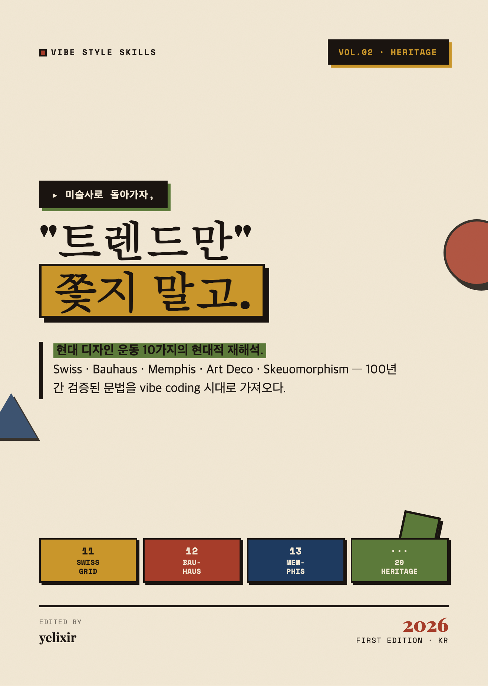
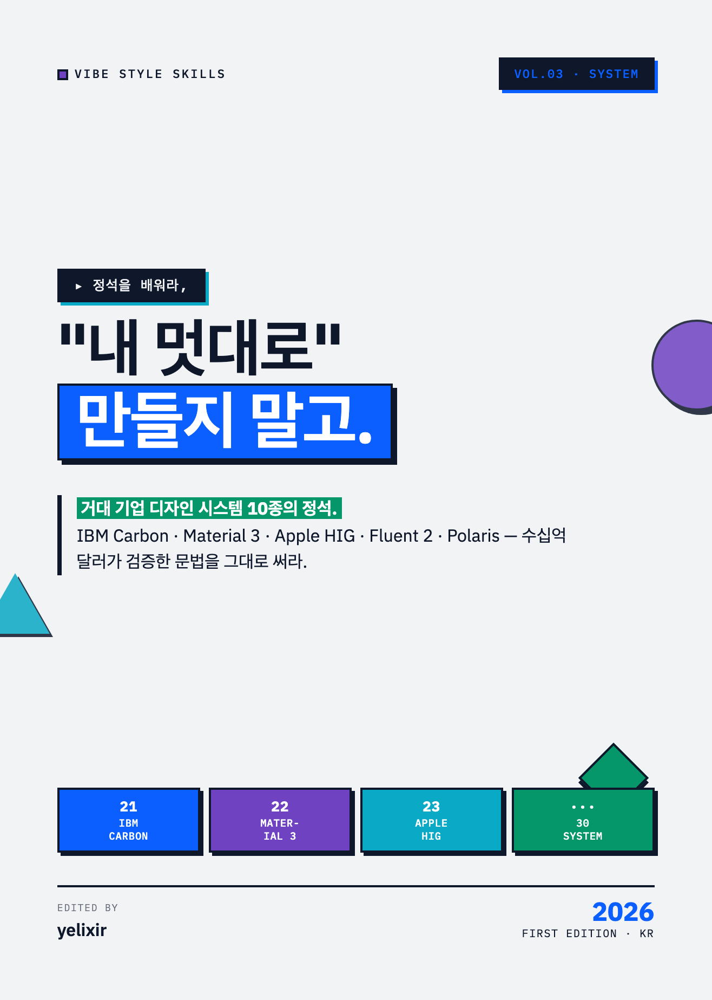
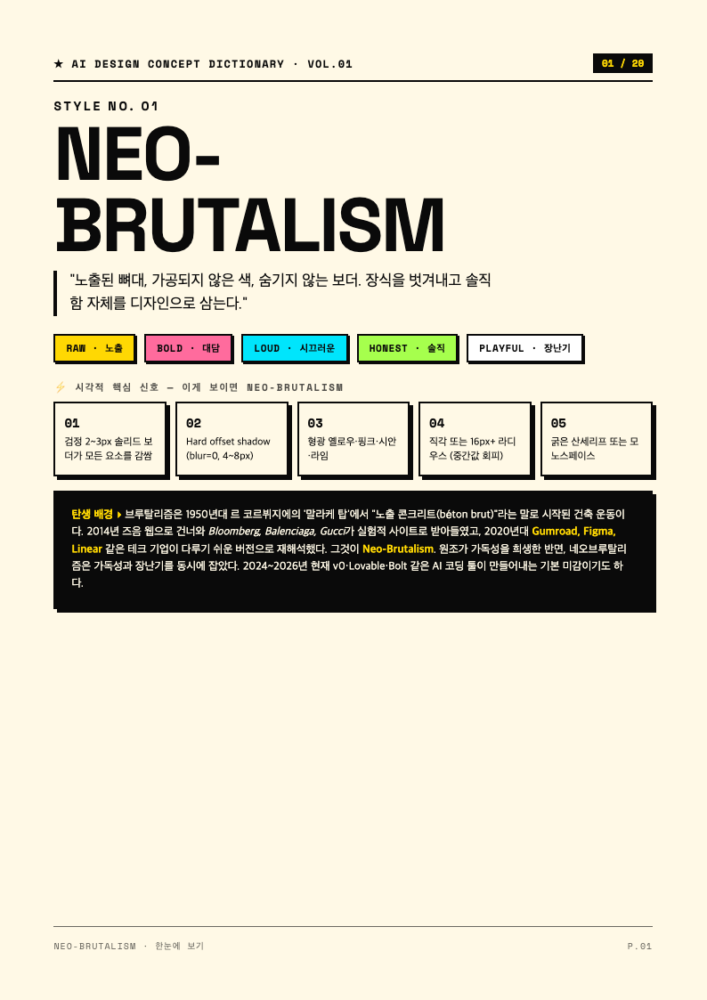
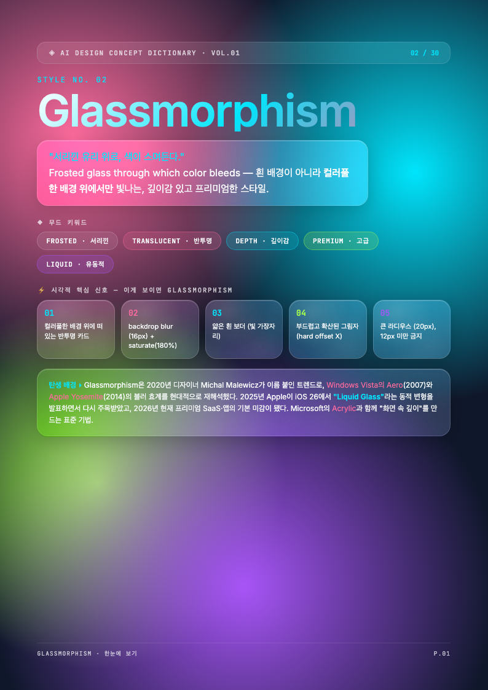

# vibe-style-skills

**이름만 알면 AI가 그린다. / Just name a style — the AI draws it.** 
30 named design styles — as Claude/GPT skills & copy-paste prompts for vibe coders.

**[English](#-english)** · **[한국어](#-한국어)**

---

<!-- ===================== ENGLISH ===================== -->

## 🇬🇧 English

### 🎯 The problem

When you tell an AI:

> "Make me a clean, modern landing page"

…you get the same default mediocre output everyone gets. But when you say:

> "Make me a **Neo-Brutalism** landing page — cream `#FFF9E6` background, 2px solid black borders, 4px offset shadows, Space Grotesk headlines"

…the AI locks onto a *specific visual grammar* and the output jumps in quality.

**Knowing the name of a style is the highest-leverage design skill of the vibe-coding era.** This repo hands you 30 of those names — as ready-to-use skills and prompts.

### 📦 What's inside

For each of the 30 styles, you get:

| Layer | File | Use |
|---|---|---|
| 🧠 **Skill** | `skills/<name>/SKILL.md` | Drop into Claude/GPT — assistant learns the style's grammar |
| 📋 **Prompts** | `prompts/<name>.md` | Copy-paste into v0, Cursor, Lovable, Bolt, Midjourney, DALL·E |
| 🎨 **Tokens** | `tokens/<name>.{json,css,js}` | Design tokens — import for instant theming |

### 🚀 Quick start

**As a Claude/GPT Skill** — copy `skills/neo-brutalism/SKILL.md` into `~/.zcode/skills/` or `~/.claude/skills/`, then ask: *"Build a portfolio in neo-brutalism style."*

**As a prompt** — open `prompts/neo-brutalism.md`, copy, paste into your tool.

**As tokens** — `const neo = require('./tokens/neo-brutalism.js')` and spread into your Tailwind config.

**Shortcut**: paste this repo URL to ChatGPT/Claude and say *"Read the skill at this link and apply it."*

---

### 📚 The 30 styles

#### Vol. 1 — **TREND** (what's hot in 2026)

| # | Style | Skill | Prompt | Tokens | Status |
|---|---|---|---|---|---|
| 01 | **Neo-Brutalism** | [SKILL](./skills/neo-brutalism/SKILL.md) | [prompt](./prompts/neo-brutalism.md) | [json](./tokens/neo-brutalism.json) · [css](./tokens/neo-brutalism.css) · [js](./tokens/neo-brutalism.js) | ✅ |
| 02 | **Glassmorphism** | [SKILL](./skills/glassmorphism/SKILL.md) | [prompt](./prompts/glassmorphism.md) | [json](./tokens/glassmorphism.json) · [css](./tokens/glassmorphism.css) · [js](./tokens/glassmorphism.js) | ✅ |
| 03 | **Bento Grid** | [SKILL](./skills/bento-grid/SKILL.md) | [prompt](./prompts/bento-grid.md) | [json](./tokens/bento-grid.json) · [css](./tokens/bento-grid.css) | ✅ |
| 04 | **Claymorphism** | [SKILL](./skills/claymorphism/SKILL.md) | [prompt](./prompts/claymorphism.md) | [json](./tokens/claymorphism.json) · [css](./tokens/claymorphism.css) | ✅ |
| 05 | **Aurora Gradient** | [SKILL](./skills/aurora-gradient/SKILL.md) | [prompt](./prompts/aurora-gradient.md) | [json](./tokens/aurora-gradient.json) · [css](./tokens/aurora-gradient.css) | ✅ |
| 06 | **Anti-Design** | [SKILL](./skills/anti-design/SKILL.md) | [prompt](./prompts/anti-design.md) | [json](./tokens/anti-design.json) | ✅ |
| 07 | **Maximalism** | [SKILL](./skills/maximalism/SKILL.md) | [prompt](./prompts/maximalism.md) | [json](./tokens/maximalism.json) | ✅ |
| 08 | **Y2K** | [SKILL](./skills/y2k/SKILL.md) | [prompt](./prompts/y2k.md) | [json](./tokens/y2k.json) | ✅ |
| 09 | **Dark Mode First** | [SKILL](./skills/dark-mode-first/SKILL.md) | [prompt](./prompts/dark-mode-first.md) | [json](./tokens/dark-mode-first.json) | ✅ |
| 10 | **3D / Immersive** | [SKILL](./skills/3d-immersive/SKILL.md) | [prompt](./prompts/3d-immersive.md) | [json](./tokens/3d-immersive.json) | ✅ |

#### Vol. 2 — **HERITAGE** (art & print movements)
`swiss` · `bauhaus` · `memphis` · `art-deco` · `editorial` · `skeuomorphism` · `neumorphism` · `hand-drawn` · `isometric` · `pixel-art`

#### Vol. 3 — **SYSTEM** (enterprise design systems)
`ibm-carbon` · `material-3` · `apple-hig` · `fluent-2` · `shopify-polaris` · `atlassian-ds` · `salesforce-lightning` · `vaporwave` · `cyberpunk` · `minimalism`

---

### 🎨 The 3-volume series

<table>
<tr>
<td align="center" width="33%">
 
<b>Vol.1 · TREND</b> 
"깔끔하게"는 그만 
cream + fluorescent
</td>
<td align="center" width="33%">
 
<b>Vol.2 · HERITAGE</b> 
트렌드만 쫓지 말고 
craft paper + vintage serif
</td>
<td align="center" width="33%">
 
<b>Vol.3 · SYSTEM</b> 
내 멋대로 만들지 말고 
cool grey + corporate blue
</td>
</tr>
</table>

Each volume shares the same layout skeleton but has its own palette, typography, and hook — reflecting the spirit of its theme.

### 📖 Companion ebook & free preview

This repo accompanies the Korean ebook **"일단 봐봐, '깔끔하게'는 그만"** — a 3-volume visual dictionary of all 30 styles.

🎁 **[FREE-PREVIEW.pdf](./ebook/FREE-PREVIEW.pdf)** (19 pages, 16MB) — Cover + Intro + Neo-Brutalism (8p) + Glassmorphism (8p) + Outro

<table>
<tr>
<td align="center" width="33%">
 
<b>Neo-Brutalism</b>
</td>
<td align="center" width="33%">
 
<b>Glassmorphism</b>
</td>
<td align="center" width="33%">
 
<b>Vol.1 Cover</b>
</td>
</tr>
</table>

### 🤝 Contributing

Contributions welcome — new named styles, improved prompts, translations, reference additions. Open an issue first or submit a PR.

### 📄 License

**MIT** for skills/prompts/tokens. Ebook PDFs in `ebook/` are © yelixir 2026.

---

<!-- ===================== KOREAN ===================== -->

## 🇰🇷 한국어

### 🎯 해결하는 문제

AI에게 이렇게 말하면:

> "깔끔하고 모던한 랜딩 페이지 만들어줘"

→ 남들 다 하는 똑같은 무난한 결과가 나옵니다. 하지만 이렇게 말하면:

> "**Neo-Brutalism** 스타일 랜딩 페이지 만들어줘 — 크림 `#FFF9E6` 배경, 검정 2px 보더, 4px 오프셋 그림자, Space Grotesk 헤드라인"

→ AI가 **정확한 시각 문법**에 lock-on해서 결과 품질이 확 뜁니다. vibe coding 시대에 **스타일 이름을 아는 것**이 가장 레버리지가 큰 디자인 능력입니다. 이 레포가 그 문법 30종을 줍니다.

### 📦 들어있는 것

각 스타일마다 3개 계층으로 제공됩니다:

| 계층 | 파일 | 용도 |
|---|---|---|
| 🧠 **스킬** | `skills/<이름>/SKILL.md` | Claude/GPT에 넣으면 어시스턴트가 스타일 문법을 학습 |
| 📋 **프롬프트** | `prompts/<이름>.md` | v0, Cursor, Lovable, Bolt, Midjourney, DALL·E에 복붙 |
| 🎨 **토큰** | `tokens/<이름>.{json,css,js}` | 디자인 토큰 — import하면 즉시 테마 적용 |

### 🚀 사용법

**Claude/GPT 스킬로** — `skills/neo-brutalism/SKILL.md`를 `~/.zcode/skills/` 또는 `~/.claude/skills/`에 복사한 뒤, 그냥 물어보세요: *"네오브루탈리즘 스타일로 포트폴리오 만들어줘"*

**프롬프트로** — `prompts/neo-brutalism.md`를 열고 복사해서 도구에 붙여넣으세요.

**토큰으로** — `tokens/neo-brutalism.js`를 require해서 Tailwind config에 spread 하세요.

**단축법**: 이 레포 URL을 ChatGPT/Claude에 주고 *"이 링크의 스킬을 읽고 적용해줘"* 라고 해도 됩니다.

---

### 📚 30 스타일

#### Vol.1 — **TREND** (2026 현재 가장 뜨는 스타일)

| # | 스타일 | 스킬 | 프롬프트 | 토큰 | 상태 |
|---|---|---|---|---|---|
| 01 | **Neo-Brutalism** | [SKILL](./skills/neo-brutalism/SKILL.md) | [프롬프트](./prompts/neo-brutalism.md) | [json](./tokens/neo-brutalism.json) · [css](./tokens/neo-brutalism.css) · [js](./tokens/neo-brutalism.js) | ✅ |
| 02 | **Glassmorphism** | [SKILL](./skills/glassmorphism/SKILL.md) | [프롬프트](./prompts/glassmorphism.md) | [json](./tokens/glassmorphism.json) · [css](./tokens/glassmorphism.css) · [js](./tokens/glassmorphism.js) | ✅ |
| 03 | **Bento Grid** | [SKILL](./skills/bento-grid/SKILL.md) | [프롬프트](./prompts/bento-grid.md) | [json](./tokens/bento-grid.json) · [css](./tokens/bento-grid.css) | ✅ |
| 04 | **Claymorphism** | [SKILL](./skills/claymorphism/SKILL.md) | [prompt](./prompts/claymorphism.md) | [json](./tokens/claymorphism.json) · [css](./tokens/claymorphism.css) | ✅ |
| 05 | **Aurora Gradient** | [SKILL](./skills/aurora-gradient/SKILL.md) | [prompt](./prompts/aurora-gradient.md) | [json](./tokens/aurora-gradient.json) · [css](./tokens/aurora-gradient.css) | ✅ |
| 06 | **Anti-Design** | [SKILL](./skills/anti-design/SKILL.md) | [prompt](./prompts/anti-design.md) | [json](./tokens/anti-design.json) | ✅ |
| 07 | **Maximalism** | [SKILL](./skills/maximalism/SKILL.md) | [prompt](./prompts/maximalism.md) | [json](./tokens/maximalism.json) | ✅ |
| 08 | **Y2K** | [SKILL](./skills/y2k/SKILL.md) | [prompt](./prompts/y2k.md) | [json](./tokens/y2k.json) | ✅ |
| 09 | **Dark Mode First** | [SKILL](./skills/dark-mode-first/SKILL.md) | [prompt](./prompts/dark-mode-first.md) | [json](./tokens/dark-mode-first.json) | ✅ |
| 10 | **3D / Immersive** | [SKILL](./skills/3d-immersive/SKILL.md) | [prompt](./prompts/3d-immersive.md) | [json](./tokens/3d-immersive.json) | ✅ |

#### Vol.2 — **HERITAGE** (미술사·인쇄 디자인 운동)
`swiss` · `bauhaus` · `memphis` · `art-deco` · `editorial` · `skeuomorphism` · `neumorphism` · `hand-drawn` · `isometric` · `pixel-art`

#### Vol.3 — **SYSTEM** (기업 디자인 시스템)
`ibm-carbon` · `material-3` · `apple-hig` · `fluent-2` · `shopify-polaris` · `atlassian-ds` · `salesforce-lightning` · `vaporwave` · `cyberpunk` · `minimalism`

---

### 🎨 3권 시리즈 표지

<table>
<tr>
<td align="center" width="33%">
 
<b>Vol.1 · TREND</b> 
"깔끔하게"는 그만 
크림 + 형광
</td>
<td align="center" width="33%">
 
<b>Vol.2 · HERITAGE</b> 
트렌드만 쫓지 말고 
크래프트 페이퍼 + 빈티지 세리프
</td>
<td align="center" width="33%">
 
<b>Vol.3 · SYSTEM</b> 
내 멋대로 만들지 말고 
쿨 그레이 + 코퍼레이트 블루
</td>
</tr>
</table>

### 📖 전자책 & 무료 맛보기

이 레포는 전자책 **"일단 봐봐, '깔끔하게'는 그만 — Vibe Coder를 위한 30가지 디자인 컨셉 × 복붙 프롬프트 사전"**의 부속 자료입니다.

🎁 **[FREE-PREVIEW.pdf](./ebook/FREE-PREVIEW.pdf)** (19페이지, 16MB) — 표지 + 서문 + Neo-Brutalism(8p) + Glassmorphism(8p) + 마무리

### 🤝 기여

기여를 환영합니다 — 새 스타일, 개선된 프롬프트, 번역, 레퍼런스 추가. 먼저 이슈를 열거나 PR을 보내주세요.

### 📄 라이선스

skills/prompts/tokens은 **MIT**. `ebook/`의 PDF는 © yelixir 2026.

---

**[⬆ 맨 위로](#vibe-style-skills)** · Made with ☕ by [yelixir](https://github.com/yelixir-dev)

